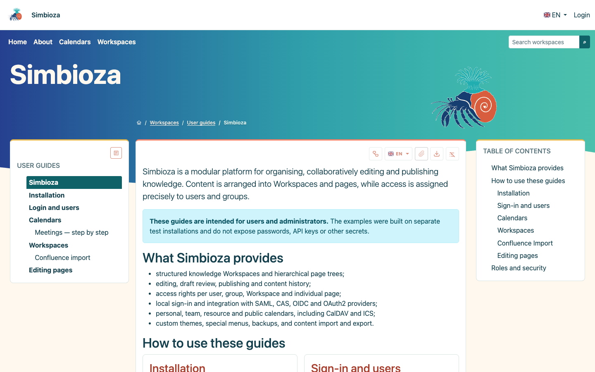

# Simbioza

[Croatian version](README_hr.md)

> Knowledge that lives together.

Simbioza is an open-source, self-hosted **wiki/CMS hybrid** for building a
knowledge base that people can actually maintain and use. A wiki makes it easy
to create and connect information; a CMS brings structure, presentation, and
control over what is published. Simbioza brings both into one application for
internal documentation, procedures, user guides, project knowledge, and public
information sites. Your content and installation remain under your control.



*A public User Guides Workspace, with its page tree, article, and table of contents.*

## Knowledge has a place to live

Organize content into **Workspaces**: each can have its own address, page tree,
members, permissions, navigation, and visual identity. Teams can work in a
shared Workspace, while restricted or personal Workspaces keep other material
in the right hands. Pages, links, breadcrumbs, and Workspace Search help readers
find their way through growing collections of information.

Authors can prepare drafts, request review, and publish when content is ready.
Readers continue to see the last published version while new work is in
progress. Editing and publishing are governed by roles and inherited
permissions, including page-level restrictions. Files belong alongside the
pages that explain them; their uploader, time, and current version are visible,
while authorized editors can inspect and download earlier versions.

## More than plain text

The full-featured visual **HTML Editor** supports formatted content, images, media,
tables, and document versions. It also provides reusable, dynamic elements:
include another page, build charts and timelines, or arrange content in tabs,
accordions, cards, and dropdowns. With the relevant modules enabled, pages can
also contain live calendars, tasks, and Workspace-aware search and page tables.
These elements are part of the same editor and obey the same access and
publication rules as the surrounding page.

Simbioza is **multilingual** in both its interface and its content. A page can
have language-specific versions and publication states; readers select their
language, while a configurable fallback keeps content accessible when a
translation is not yet available. New interface languages can be added with a
consolidated language pack instead of changing every module separately.

## Make it yours, without fragmenting the experience

Customize the site theme, light and dark appearance, header, and menus. A
Workspace manager can give their Workspace its own theme and special top or
side menus without changing the rest of the site. The page tree and document
outline can be tuned to suit the content. Navigation, permissions, the editor,
search, and notifications then work together rather than feeling like separate
tools.

Simbioza is modular beneath that unified experience. Install the capabilities
your site needs and add optional ones later:

- **Content and discovery:** Workspace, Workspace Search, HTML Editor, Task,
  and Comment.
- **People and communication:** Auth, Simbioza User, Notification, and E-mail.
- **Presentation and planning:** Menu, Theme, and Calendar.
- **Integration and operations:** API, Audit, Backup, and ORM.

For example, a review request can notify publishers in the application and,
when E-mail is enabled, by mail; Backup can include the data of installed
modules; and the API exposes permitted content without bypassing its access
rules. The optional Confluence importer can bring existing pages and
attachments into Workspaces. Modules extend the same application without
forcing every installation to use every feature.

Start with the [installation guide](docs/installation_en.md) or explore the
[documentation](docs/index_en.md). The interface and guides are also available
in [Croatian](README_hr.md).

## Dependencies

Simbioza is built on the HeartPhrame Framework and its independently maintained
modules. Application work belongs here and in module repositories; the
Framework is consumed from its tagged `v0.0.25` release and is not developed
as part of this repository.

Every HeartPhrame module requires `aaieduhr/heartphrame-framework:^0.0.25`.
Required module order and optional capabilities are listed in
[the dependency matrix](docs/module-dependencies_en.md).

The smallest verified installations are Framework only, Framework + Theme,
Framework + Menu, and Framework + Theme + Menu. Database-backed modules add ORM
and their documented domain dependencies. Composer resolves all transitive
dependencies automatically.

## Requirements

- PHP 8.2 or newer
- Composer 2
- PDO SQLite for the default local setup
- Git access to the listed module repositories

## Dependency policy

The Framework is constrained to `^0.0.25`, while Simbioza modules use the
compatible `^0.1.0` release line. This application does not commit
`composer.lock`; each CI run resolves the latest compatible tagged releases and
executes the complete quality suite. Production deployments may retain their
own verified lock file outside the source repository.

Committed Composer metadata uses VCS repositories so a clean CI checkout works
without sibling directories. For local work with symlinked module checkouts,
use an untracked `composer.local.json` through the `COMPOSER` environment
variable; do not commit local `path` repositories into the shared manifest.

## Installation and verification

```bash
composer update --with-all-dependencies
composer check-platform-reqs
composer on-commit
npm install --no-package-lock
npx playwright install chromium
composer e2e
```

A deployed release may intentionally omit `.git` and retain its own verified
`composer.lock`. From release `0.1.9` onward, check and install the newest stable
application and compatible module tags from the installation root with:

```bash
php update.php --check
php update.php
```

The FPM and Apache mod_php installation paths, including GUI and CLI update
procedures, are documented in [Installing Simbioza](docs/installation_en.md).

Application configuration, migrations, module order, and API integration are
described in the [English documentation](docs/index_en.md). The Croatian
documentation has a separate [Croatian index](docs/index_hr.md).

## Documentation

- Main index (EN): [docs/index_en.md](docs/index_en.md)
- Main index (HR): [docs/index_hr.md](docs/index_hr.md)
- [Installation](docs/installation_en.md)
- [Dedicated PHP-FPM installation](docs/installation_fpm_en.md)
- [Apache mod_php installation](docs/installation_mod_php_en.md)
- [Six clean installations and screenshots](docs/installation-lab_en.md)
- [Module dependencies](docs/module-dependencies_en.md)
- [Database configuration](docs/database_en.md)
- [API v1 contract](docs/api-v1-contract_en.md)
- [End-to-end testing](docs/end-to-end-testing_en.md)
- [Brand identity and theme](docs/branding_en.md)
- [Release 0.1.96: optional settings follow module installation](docs/release-0.1.96_en.md)
- [Release 0.1.95: reliable optional settings and installer checks](docs/release-0.1.95_en.md)
- [Optional-module-safe updater in 0.1.77](docs/release-0.1.77_en.md)
- [FPM-safe CLI updater delegation in 0.1.76](docs/release-0.1.76_en.md)
- [Effective module lifecycle and dual-mode CLI in 0.1.75](docs/release-0.1.75_en.md)
- [FPM-safe persistent settings update in 0.1.74](docs/release-0.1.74_en.md)
- [Attachment layout, safe settings merge, and release checks in 0.1.73](docs/release-0.1.73_en.md)
- [Meeting planning and bundled guides in release 0.1.68](docs/release-0.1.68_en.md)

The E2E suite includes non-sensitive ORM and HTTP measurements plus durable
budgets for SQL count, request duration, peak memory, and response size. The
same complete suite runs on SQLite, PostgreSQL, and MySQL in CI.

Workspace maintenance optimizes existing images as a persistent, resumable job
with a visible progress bar. Images are processed in bounded batches so a large
site never holds one HTTP request open for the entire collection; source files
remain unchanged.

## Personal preferences and module integration

Simbioza User adds following, notification delivery rules, and restricted
personal Workspaces created at first sign-in under an administrator-controlled
policy. It also provides a personal light/dark/automatic/system choice while
the global Theme policy is automatic. Modules keep ownership of their domain
rules; the application composes them and supplies deployment settings.

## Licence

This work is published under the
[European Union Public Licence (EUPL) v1.2](LICENSE).

## Donations and professional services

Simbioza and its modules are open source. All features are available to
everyone under their applicable open-source licences: there is no paid edition
and no functionality unlocked by a donation. Voluntary donations through
[GitHub Sponsors](https://github.com/sponsors/kmihalj) help sustain development.

If you need hands-on help, on-site installation and configuration, migration
of content and data from existing systems, and custom modules or integrations
are available as paid work by agreement. The fee is for the work, not for
access to Simbioza's features. For an inquiry or estimate, contact
[kmihalj@me.com](mailto:kmihalj@me.com).

## Community

- [Authors](AUTHORS.md)
- [Get support](SUPPORT.md)
- [Report a security vulnerability privately](SECURITY.md)
- [Contribute](CONTRIBUTING.md)
