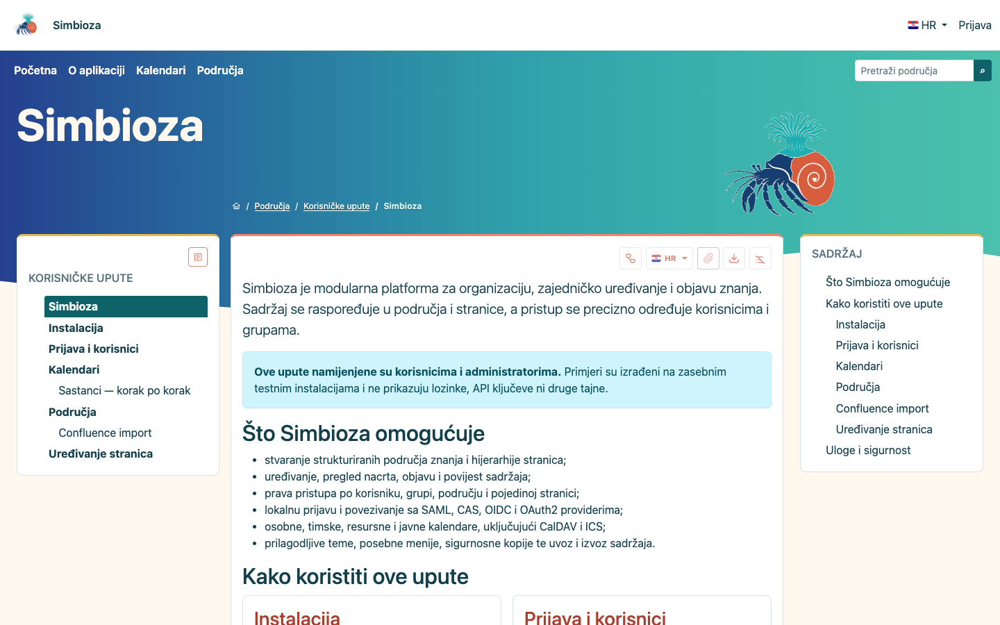

# Simbioza

[Engleska verzija](README.md)

> Znanje koje živi zajedno.

Simbioza je otvorena aplikacija za vlastiti poslužitelj: **hibrid wikija i
CMS-a** za izgradnju baze znanja koju je lako održavati i koristiti. Wiki
olakšava stvaranje i povezivanje informacija, a CMS daje strukturu, izgled i
kontrolu nad objavljenim sadržajem. Simbioza spaja oboje u jednu aplikaciju za
internu dokumentaciju, postupke, korisničke upute, projektno znanje i javne
informacijske stranice. Instalacija i podaci ostaju pod vašom kontrolom.



*Javno područje Korisničke upute sa stablom stranica, člankom i kazalom.*

## Znanje ima svoje mjesto

Sadržaj organizirajte u **područja**: svako može imati vlastitu adresu, stablo
stranica, članove, ovlasti, navigaciju i vizualni identitet. Timovi mogu raditi
u zajedničkom području, dok ograničena i osobna područja čuvaju ostale
materijale za one kojima su namijenjeni. Stranice, poveznice, putanja kroz
sadržaj i pretraživanje područja pomažu čitateljima snaći se i u velikoj bazi
znanja.

Autori mogu pripremiti nacrt, zatražiti pregled i objaviti sadržaj kada je
spreman. Čitatelji i dalje vide posljednju objavljenu verziju dok nastaju
izmjene. Uređivanje i objavljivanje uređuju uloge i naslijeđene ovlasti, uz
mogućnost ograničenja pojedinih stranica. Datoteke su uz stranice kojima
pripadaju; vidljivo je tko ih je i kada učitao te koja je inačica aktualna,
dok ovlašteni urednici mogu pregledati i preuzeti starije inačice.

## Više od običnog teksta

Cjeloviti vizualni **HTML editor** podržava oblikovanje sadržaja, slike,
multimediju, tablice i inačice dokumenata. Ima i napredne dinamičke elemente:
uključivanje sadržaja druge stranice, grafikone, vremenske crte te sadržaj
organiziran u kartice (tabove), harmonike, kartične blokove i padajuće blokove. Uz
odgovarajuće module u stranice se mogu umetnuti i živi kalendari, zadaci te
pretraživanje i tablice stranica vezane uz područje. Sve se uređuje na jednom
mjestu i poštuje iste ovlasti i pravila objavljivanja kao ostatak stranice.

Simbioza je **višejezična** u sučelju i sadržaju. Stranica može imati zasebne
inačice i stanja objave po jeziku; čitatelj bira jezik, a podesivi pričuvni
jezik pomaže kada prijevod još ne postoji. Novi jezik sučelja može se dodati
objedinjenim jezičnim paketom, bez zasebnog mijenjanja svakog modula.

## Prilagodite je sebi, bez razbijanja cjeline

Prilagodite temu, svijetli i tamni prikaz, zaglavlje i izbornike cijele
aplikacije. Upravitelj područja može svojem području dati zasebnu temu te
posebne gornje ili bočne izbornike, bez promjene ostatka sustava. Vidljivost
stabla stranica i kazala također se može prilagoditi vrsti građe.
Navigacija, ovlasti, editor, pretraživanje i obavijesti pritom rade kao jedna
cjelina, a ne kao skup nepovezanih alata.

Ispod jedinstvenog sučelja Simbioza je modularna. Instalirajte ono što je
potrebno, a opcionalne mogućnosti dodajte poslije:

- **Sadržaj i pronalaženje:** Workspace (područja), Workspace Search, HTML
  Editor, Task i Comment.
- **Korisnici i komunikacija:** Auth, Simbioza User, Notification i E-mail.
- **Izgled i planiranje:** Menu, Theme i Calendar.
- **Integracija i održavanje:** API, Audit, Backup i ORM.

Primjerice, zahtjev za pregled može obavijestiti objavljivače u aplikaciji i,
ako je uključen E-mail, poštom; Backup može obuhvatiti podatke
instaliranih modula; a API izlaže dopušteni sadržaj uz iste provjere ovlasti.
Opcionalni Confluence importer može prenijeti postojeće stranice i privitke u
područja. Moduli proširuju istu aplikaciju, ali svaka instalacija ne mora
koristiti baš sve mogućnosti.

Počnite s [uputom za instalaciju](docs/installation_hr.md) ili pregledajte
[dokumentaciju](docs/index_hr.md). Sučelje i upute dostupni su i na
[engleskom](README.md).

## Ovisnosti

Simbioza je izgrađena na HeartPhrame Frameworku i njegovim samostalno
održavanim modulima. Aplikacijski razvoj pripada ovdje i u repozitorije modula;
Framework se koristi iz označenog izdanja `v0.0.25` i ne razvija se u ovom
repozitoriju.

Svaki HeartPhrame modul zahtijeva
`aaieduhr/heartphrame-framework:^0.0.25`. Obavezni redoslijed modula i
opcionalne mogućnosti navedeni su
u [matrici ovisnosti](docs/module-dependencies_hr.md).

Najmanje provjerene instalacije su samo Framework, Framework + Theme,
Framework + Menu te Framework + Theme + Menu. Moduli s bazom dodaju ORM i svoje
dokumentirane domenske ovisnosti. Composer automatski razrješava sve tranzitivne
ovisnosti.

## Preduvjeti

- PHP 8.2 ili noviji
- Composer 2
- PDO SQLite za zadanu lokalnu instalaciju
- Git pristup navedenim repozitorijima modula

## Politika ovisnosti

Framework je ograničen na `^0.0.25`, a Simbioza moduli koriste kompatibilnu
liniju izdanja `^0.1.0`. Aplikacija ne sprema `composer.lock`; svaki CI dohvaća
najnovija kompatibilna označena izdanja i pokreće cijeli skup provjera kvalitete.
Produkcijski deployment može izvan izvornog repozitorija čuvati vlastiti
provjereni lock.

Spremljeni Composer metapodaci koriste VCS repozitorije kako bi čista CI kopija
radila bez susjednih direktorija. Za lokalni rad sa simbolički povezanim
modulima koristi se nespremljeni `composer.local.json` preko varijable
`COMPOSER`; lokalni `path` repozitoriji ne spremaju se u zajednički manifest.

## Instalacija i provjera

```bash
composer update --with-all-dependencies
composer check-platform-reqs
composer on-commit
npm install --no-package-lock
npx playwright install chromium
composer e2e
```

Poslužiteljska release instalacija smije namjerno biti bez `.git` direktorija i
čuvati vlastiti provjereni `composer.lock`. Od izdanja `0.1.9` nadalje iz
korijena instalacije provjerite i instalirajte najnovije stabilne tagove
aplikacije i kompatibilnih modula ovako:

```bash
php update.php --check
php update.php
```

Cijeli postupak release instalacije i nadogradnje opisan je u
[uputama za instalaciju](docs/installation_hr.md).
Nakon početnog podešavanja redovna nadogradnja ne zahtijeva `sudo`; uputa
opisuje zasebne postupke za FPM i instalacije bez FPM-a.

Konfiguracija aplikacije, migracije, redoslijed modula i API integracija opisani
su u [hrvatskoj dokumentaciji](docs/index_hr.md). Engleska dokumentacija ima
zaseban [engleski indeks](docs/index_en.md).

## Dokumentacija

- [Izdanje 0.1.96: postavke prate instalaciju modula](docs/release-0.1.96_hr.md)
- [Izdanje 0.1.95: pouzdane postavke modula i provjere instalacije](docs/release-0.1.95_hr.md)
- Glavni indeks (HR): [docs/index_hr.md](docs/index_hr.md)
- Glavni indeks (EN): [docs/index_en.md](docs/index_en.md)
- [Planiranje sastanaka i isporučene upute u izdanju 0.1.68](docs/release-0.1.68_hr.md)
- [Instalacija](docs/installation_hr.md)
- [Instalacija s namjenskim PHP-FPM-om](docs/installation_fpm_hr.md)
- [Instalacija s Apache mod_php modulom](docs/installation_mod_php_hr.md)
- [Zapis šest čistih instalacija i screenshotovi](docs/installation-lab_hr.md)
- [Ovisnosti modula](docs/module-dependencies_hr.md)
- [Konfiguracija baze](docs/database_hr.md)
- [API v1 ugovor](docs/api-v1-contract_hr.md)
- [End-to-end testiranje](docs/end-to-end-testing_hr.md)
- [Vizualni identitet i tema](docs/branding_hr.md)

E2E skup uključuje neosjetljiva ORM i HTTP mjerenja te trajne budžete za broj
SQL upita, trajanje zahtjeva, vršnu memoriju i veličinu odgovora. Isti potpuni
skup u CI-ju se pokreće na SQLiteu, PostgreSQL-u i MySQL-u.

Održavanje područja optimizira postojeće slike kao trajni i nastavivi posao s
vidljivim progress barom. Slike se obrađuju u ograničenim serijama, pa veliki
site više ne drži jedan HTTP zahtjev otvorenim tijekom cijele obrade; izvorne
datoteke ostaju nepromijenjene.

## Osobne postavke i povezivanje modula

Simbioza User dodaje praćenja, pravila dostave obavijesti i ograničena osobna
područja koja se mogu izraditi pri prvoj prijavi prema administratorskom
pravilu. Dodaje i osobni svijetli/tamni/automatski/sistemski odabir dok je
globalni način modula Theme automatski. Moduli zadržavaju svoja domenska
pravila, a aplikacija ih povezuje i daje postavke instalacije.

## Licencija

Ovaj rad objavljen je pod
[Javnom licencijom Europske unije (EUPL) v1.2](LICENSE).

## Donacije i profesionalne usluge

Simbioza i njezini moduli otvorenog su koda. Sve mogućnosti dostupne su svima
pod pripadajućim licencijama otvorenog koda: nema plaćenog izdanja ni funkcija
koje se otključavaju donacijom. Dobrovoljne donacije putem
[GitHub Sponsors](https://github.com/sponsors/kmihalj) pomažu održati razvoj.

Ako vam treba praktična pomoć, instalacija i podešavanje na lokaciji korisnika,
prijenos sadržaja i podataka iz postojećih sustava te izrada prilagođenih
modula ili integracija mogu se ugovoriti kao plaćene usluge. Naplaćuje se rad,
a ne pristup mogućnostima Simbioze. Za dogovor ili ponudu pišite na
[kmihalj@me.com](mailto:kmihalj@me.com).

## Zajednica

- [Autori](AUTHORS_hr.md)
- [Podrška](SUPPORT_hr.md)
- [Privatna prijava sigurnosne ranjivosti](SECURITY_hr.md)
- [Doprinos projektu](CONTRIBUTING_hr.md)
