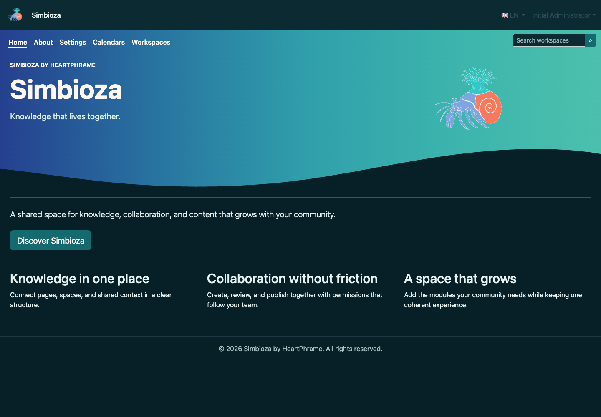
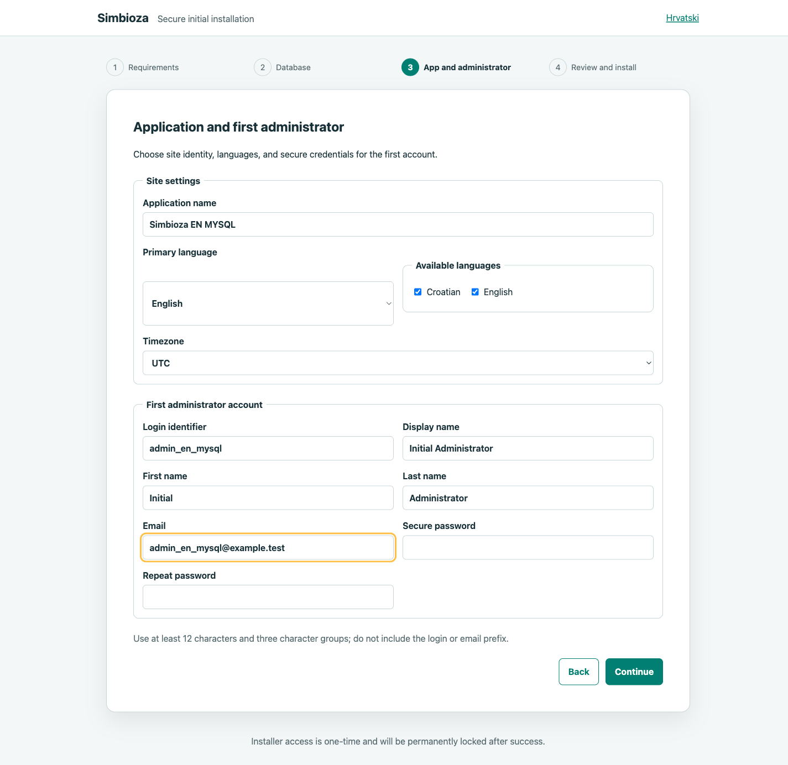
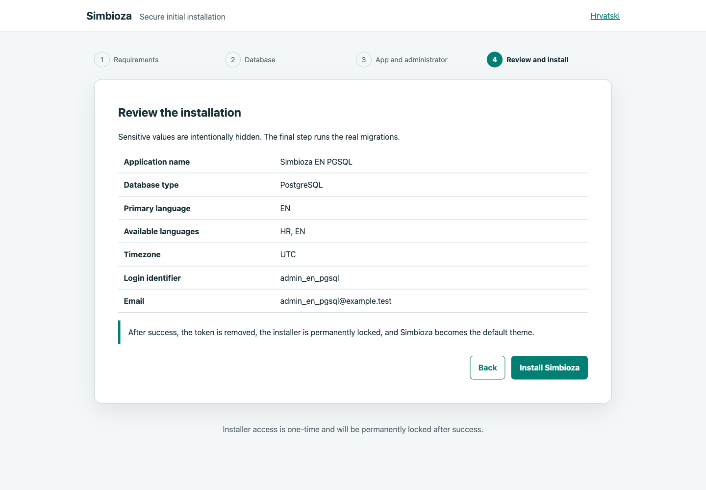
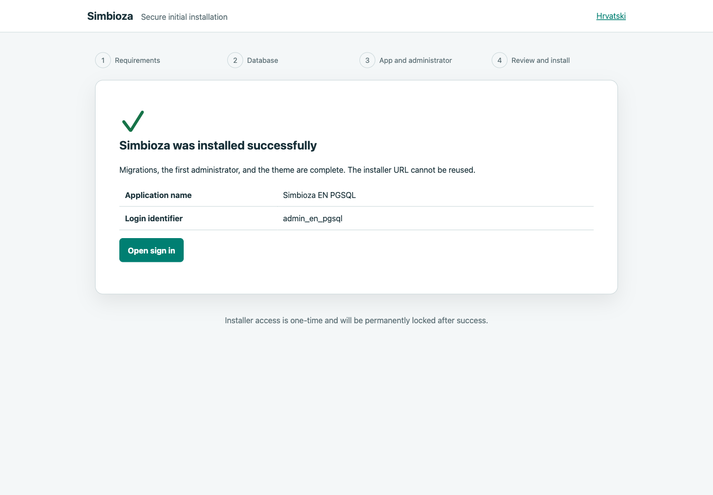
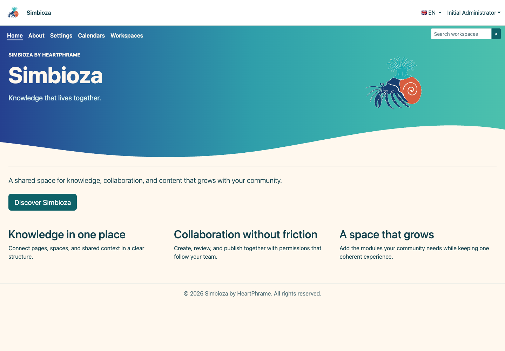

# Six clean installations: lab record

[Hrvatska verzija](installation-lab_hr.md)

This record documents real installations performed on 25 August 2026 on the
local macOS development host. It is not a general production recipe. Every
installation has its own directory, configuration, and database; Homebrew
Apache's web root contains only a symbolic link to each `public/` directory.

No confidential value was written to Git, terminal output, or a screenshot.
The private administrator/database credential inventory is stored locally at
`/Volumes/Ext/Development/CR/_codex_backups/simbioza-install-credentials-20260825.json`
with mode `0600`. Every installer token was consumed on first use and removed
from its application.

## Results

| Installation | Real database | Primary locale | Migrations | Administrator | Theme and graphics | HTTP and GUI |
|---|---|---:|---:|---:|---|---|
| `simbioza_hr_SQLite` | SQLite 3.53.4 | HR | 22 | 1, login passed | `simbioza-imported`, auto, 25 files | home/login 200, installer 404 |
| `simbioza_hr_MySQL` | MySQL 9.7.1, TCP 3307 | HR | 22 | 1, login passed | `simbioza-imported`, auto, 25 files | home/login 200, installer 404 |
| `simbioza_hr_PGSQL` | PostgreSQL 18.6 | HR | 22 | 1, login passed | `simbioza-imported`, auto, 25 files | home/login 200, installer 404 |
| `simbioza_en_SQLite` | SQLite 3.53.4 | EN | 22 | 1, login passed | `simbioza-imported`, auto, 25 files | home/login 200, installer 404 |
| `simbioza_en_MySQL` | MySQL 9.7.1, TCP 3307 | EN | 22 | 1, login passed | `simbioza-imported`, auto, 25 files | home/login 200, installer 404 |
| `simbioza_en_PGSQL` | PostgreSQL 18.6 | EN | 22 | 1, login passed | `simbioza-imported`, auto, 25 files | home/login 200, installer 404 |

For every case, Playwright completed the whole wizard, signed in with the first
administrator, checked every visible image, forced light and dark
`prefers-color-scheme`, and confirmed distinct computed backgrounds. A separate
PDO verification reopened the real database and checked 22 `_hph_migrations`
rows, exactly one active administrator, and that administrator's password hash.

## Commands actually used

### Clean directories

The installer worktree diff was intentionally overlaid on a clean `HEAD`
archive because the matrix ran before the final commit. Existing HFC runtime
files, including SMTP configuration, were not copied.

```bash
install_id=simbioza_en_SQLite
install_root=/Volumes/Ext/Development/CR/$install_id

mkdir "$install_root"
git -C /Volumes/Ext/Development/CR/HFClean archive --format=tar HEAD |
  tar -x -C "$install_root"
rsync -a \
  --exclude='.git/' --exclude='vendor/' --exclude='data/' \
  --exclude='build/' --exclude='node_modules/' --exclude='coverage/' \
  --exclude='output/' --exclude='composer.local.json' \
  --exclude='composer.local.lock' --exclude='config/database.php' \
  --exclude='config/env.php' --exclude='config/installation.php' \
  --exclude='config/email.php' --exclude='config/workspace.php' \
  /Volumes/Ext/Development/CR/HFClean/ "$install_root/"
cp -al /Volumes/Ext/Development/CR/HFClean/vendor "$install_root/vendor"
mkdir -p "$install_root/data/logs" "$install_root/data/cache" "$install_root/data/themes"
chmod 750 \
  "$install_root/config" \
  "$install_root/data" \
  "$install_root/resources/config/theme" \
  "$install_root/resources/config/menu"
```

Both configuration stores must be writable: the installer imports the theme,
while the starter guide workspace also restores its special-menu configuration.

`cp -al` is only a disk-saving optimization in this local lab. A normal
installation must run Composer as described in the main
[installation guide](installation_en.md).

### Real MySQL and PostgreSQL

The existing MySQL application account did not have administrative privileges,
and its root secret was neither read nor changed. A separate real MySQL 9.7
instance was therefore started without affecting the existing service:

```bash
service_root=/Volumes/Ext/Development/CR/_codex_services/mysql-install-matrix
mkdir -p "$service_root/data" "$service_root/run"
chmod 700 "$service_root" "$service_root/data" "$service_root/run"
mysqld --no-defaults --initialize-insecure \
  --datadir="$service_root/data" --log-error="$service_root/initialize.log"
mysqld --no-defaults --daemonize --datadir="$service_root/data" \
  --port=3307 --bind-address=127.0.0.1 \
  --socket="$service_root/run/mysql.sock" \
  --pid-file="$service_root/run/mysql.pid" --log-error="$service_root/mysql.log"
mysqladmin --protocol=tcp -h127.0.0.1 -P3307 -uroot ping
```

A temporary local script created two empty MySQL databases with two restricted
users and two empty PostgreSQL databases with roles lacking `SUPERUSER`,
`CREATEDB`, `CREATEROLE`, replication, and bypass-RLS privileges:

```bash
php /tmp/provision_simbioza_matrix_databases.php
```

It read passwords from the private `0600` inventory and never printed them.

### Apache links and one-time installer

The same operations were repeated for all six identifiers:

```bash
ln -s /Volumes/Ext/Development/CR/simbioza_en_SQLite/public \
  /opt/homebrew/var/www/simbioza_en_SQLite

/Volumes/Ext/Development/CR/simbioza_en_SQLite/bin/simbioza \
  install:prepare \
  --base-url=https://piko.webhop.me/simbioza_en_SQLite
```

The printed token URL was opened only in the named Playwright Chromium session.
Screenshots were taken only after the clean `/install` redirect. On the first
PostgreSQL attempt, a stale Apache `mod_php` worker crashed inside `pdo_pgsql`;
the database remained empty. A controlled `apachectl -k graceful` reloaded the
current PHP 8.5.9/libpq libraries, existing HFC immediately returned HTTP 200,
and both repeated PostgreSQL flows passed.

### Final verification

```bash
php /tmp/verify_simbioza_install_matrix.php

for install_id in \
  simbioza_hr_SQLite simbioza_hr_MySQL simbioza_hr_PGSQL \
  simbioza_en_SQLite simbioza_en_MySQL simbioza_en_PGSQL; do
  base_url="https://piko.webhop.me/$install_id"
  curl -sS -o /dev/null -w '%{http_code}\n' "$base_url/"
  curl -sS -o /dev/null -w '%{http_code}\n' "$base_url/auth/login"
  curl -sS -o /dev/null -w '%{http_code}\n' "$base_url/install"
  curl -sS -o /dev/null -w '%{http_code}\n' "$base_url/theme.css"
done
```

Expected and observed for every installation: home, sign-in, and `theme.css`
return 200; the locked installer returns 404.

## English installation screenshots

Every image uses a desktop viewport 1440 CSS pixels wide. Passwords were filled
only after the database/application screenshots; review never renders them.

### EN / SQLite




### EN / MySQL





### EN / PostgreSQL






