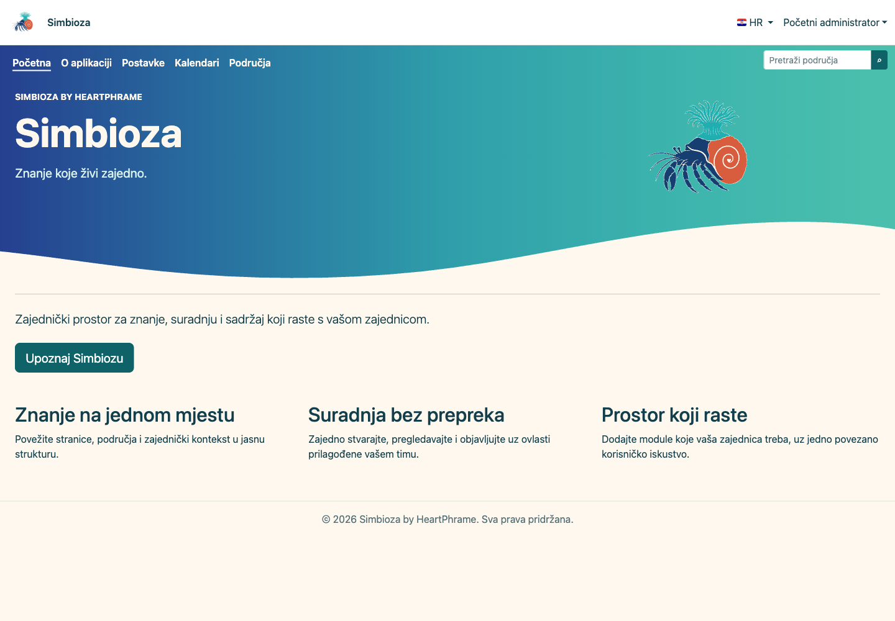
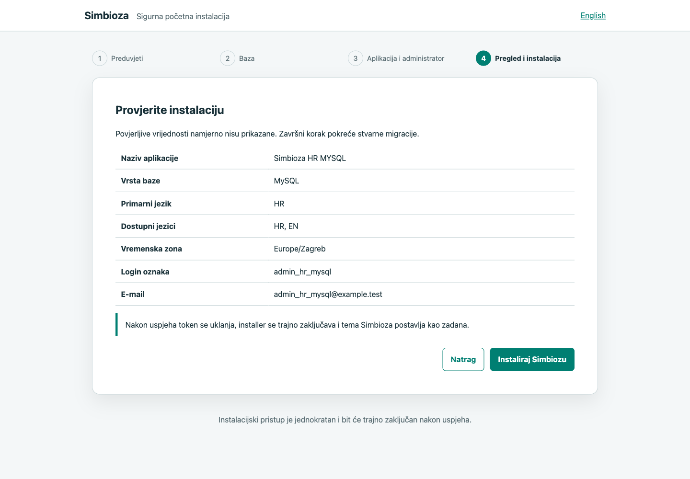
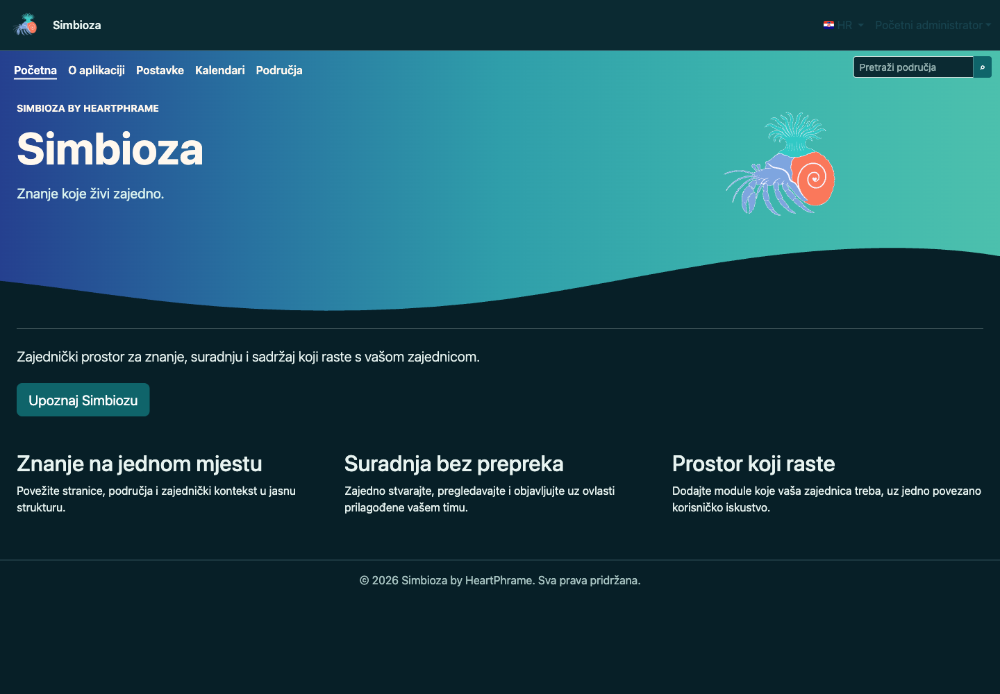
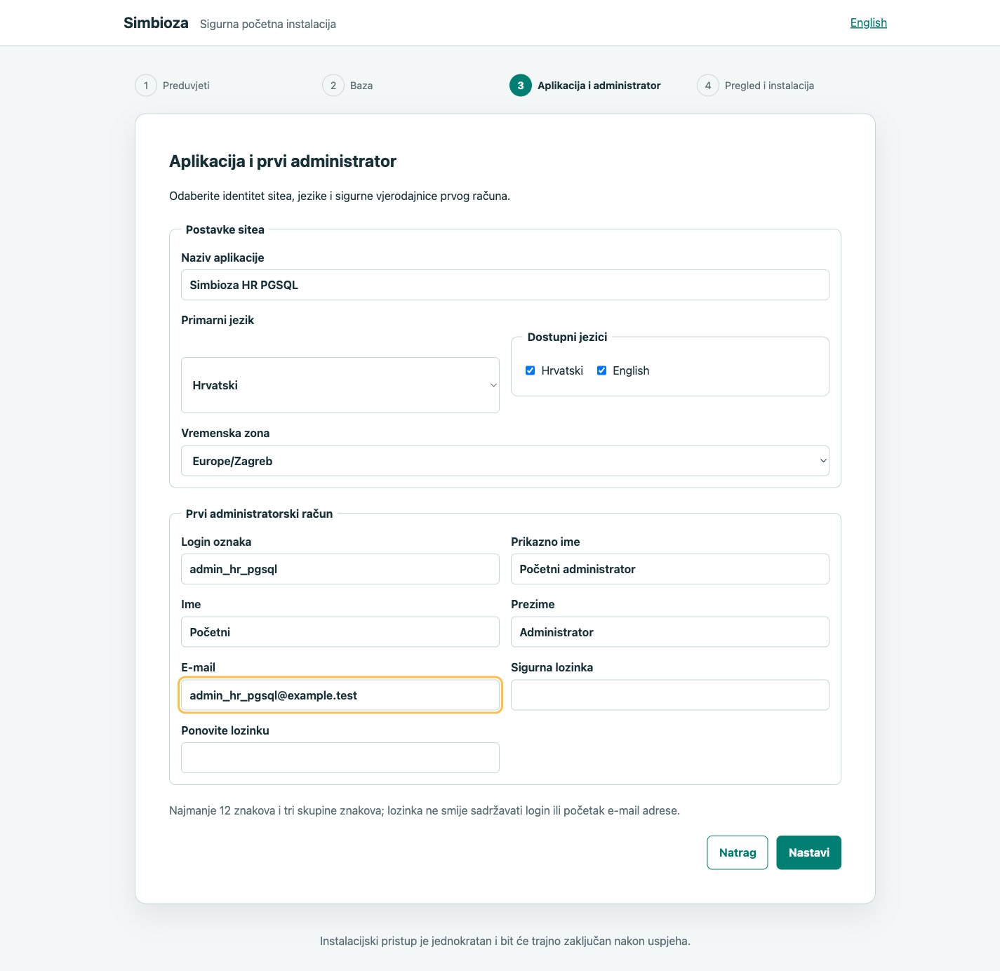
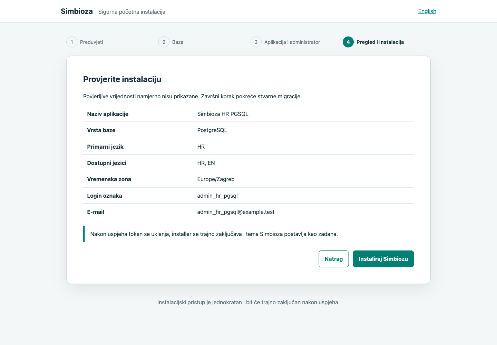
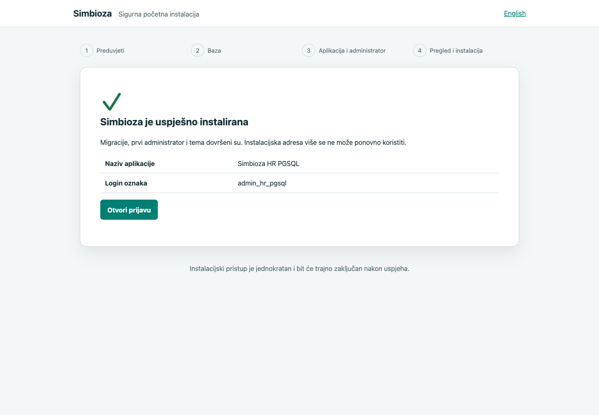

# Laboratorijski zapis šest čistih instalacija

[English version](installation-lab_en.md)

Ovaj zapis dokumentira stvarne instalacije izvedene 25. kolovoza 2026. na
lokalnom macOS razvojnom računalu. Nije opći produkcijski recept. Svaka
instalacija ima zaseban direktorij, konfiguraciju i bazu; u Homebrew Apacheovu
web-rootu nalazi se samo simbolička poveznica prema njezinu `public/`
direktoriju.

Povjerljive vrijednosti nisu zapisane u Git, terminalski izlaz ni screenshotove.
Privatni popis administratorskih i baznih vjerodajnica nalazi se u lokalnoj
datoteci
`/Volumes/Ext/Development/CR/_codex_backups/simbioza-install-credentials-20260825.json`
s pravima `0600`. Instalacijski tokeni potrošeni su pri prvom otvaranju i
uklonjeni iz svake aplikacije.

## Rezultat

| Instalacija | Stvarna baza | Primarni jezik | Migracije | Administrator | Tema i grafika | HTTP i GUI |
|---|---|---:|---:|---:|---|---|
| `simbioza_hr_SQLite` | SQLite 3.53.4 | HR | 22 | 1, login prošao | `simbioza-imported`, auto, 25 datoteka | home/login 200, installer 404 |
| `simbioza_hr_MySQL` | MySQL 9.7.1, TCP 3307 | HR | 22 | 1, login prošao | `simbioza-imported`, auto, 25 datoteka | home/login 200, installer 404 |
| `simbioza_hr_PGSQL` | PostgreSQL 18.6 | HR | 22 | 1, login prošao | `simbioza-imported`, auto, 25 datoteka | home/login 200, installer 404 |
| `simbioza_en_SQLite` | SQLite 3.53.4 | EN | 22 | 1, login prošao | `simbioza-imported`, auto, 25 datoteka | home/login 200, installer 404 |
| `simbioza_en_MySQL` | MySQL 9.7.1, TCP 3307 | EN | 22 | 1, login prošao | `simbioza-imported`, auto, 25 datoteka | home/login 200, installer 404 |
| `simbioza_en_PGSQL` | PostgreSQL 18.6 | EN | 22 | 1, login prošao | `simbioza-imported`, auto, 25 datoteka | home/login 200, installer 404 |

Playwright je za svaku instalaciju izveo cijeli web-tijek, prijavio se prvim
administratorom, provjerio učitavanje svih vidljivih slika, prisilio light i
dark `prefers-color-scheme` te potvrdio različite izračunate pozadine. Zasebna
PDO provjera ponovno je otvorila svaku stvarnu bazu, provjerila 22 retka u
`_hph_migrations`, točno jednog aktivnog administratora i njegov hash lozinke.

## Stvarno korištene naredbe

### Priprema čistih direktorija

Radni diff instalera namjerno je prenesen preko čistog `HEAD` arhiva jer se
matrica izvodila prije završnog commita. Runtime datoteke postojeće HFC
instalacije, uključujući SMTP konfiguraciju, nisu kopirane.

```bash
install_id=simbioza_hr_SQLite
install_root=/Volumes/Ext/Development/CR/$install_id

mkdir "$install_root"
git -C /Volumes/Ext/Development/CR/HFClean archive --format=tar HEAD |
  tar -x -C "$install_root"
rsync -a \
  --exclude='.git/' --exclude='vendor/' --exclude='data/' \
  --exclude='build/' --exclude='node_modules/' --exclude='coverage/' \
  --exclude='output/' --exclude='composer.local.json' \
  --exclude='composer.local.lock' --exclude='config/database.php' \
  --exclude='config/env.php' --exclude='config/installation.php' \
  --exclude='config/email.php' \
  /Volumes/Ext/Development/CR/HFClean/ "$install_root/"
cp -al /Volumes/Ext/Development/CR/HFClean/vendor "$install_root/vendor"
mkdir -p "$install_root/data/logs" "$install_root/data/cache" "$install_root/data/themes"
chmod 750 \
  "$install_root/config" \
  "$install_root/data" \
  "$install_root/resources/config/theme" \
  "$install_root/resources/config/menu"
```

Zapisivost oba konfiguracijska spremišta je obvezna: installer uvozi temu, a
početno područje s uputama obnavlja i svoju posebnu konfiguraciju izbornika.

`cp -al` je samo lokalna ušteda prostora ovog laboratorija; normalna instalacija
treba pokrenuti Composer kako opisuje glavna [instalacijska uputa](installation_hr.md).

### Stvarni MySQL i PostgreSQL

Postojeći MySQL aplikacijski račun nije imao administrativne ovlasti, a njegova
root tajna nije čitana niti mijenjana. Zato je podignuta zasebna stvarna MySQL
9.7 instanca za test, bez utjecaja na postojeći servis:

```bash
service_root=/Volumes/Ext/Development/CR/_codex_services/mysql-install-matrix
mkdir -p "$service_root/data" "$service_root/run"
chmod 700 "$service_root" "$service_root/data" "$service_root/run"
mysqld --no-defaults --initialize-insecure \
  --datadir="$service_root/data" --log-error="$service_root/initialize.log"
mysqld --no-defaults --daemonize --datadir="$service_root/data" \
  --port=3307 --bind-address=127.0.0.1 \
  --socket="$service_root/run/mysql.sock" \
  --pid-file="$service_root/run/mysql.pid" --log-error="$service_root/mysql.log"
mysqladmin --protocol=tcp -h127.0.0.1 -P3307 -uroot ping
```

Privremena lokalna skripta izradila je dvije prazne MySQL baze i dva ograničena
korisnika te dvije prazne PostgreSQL baze i dvije uloge bez `SUPERUSER`,
`CREATEDB`, `CREATEROLE`, replikacijskih ili bypass-RLS ovlasti:

```bash
php /tmp/provision_simbioza_matrix_databases.php
```

Lozinke je skripta čitala iz privatne `0600` datoteke i nije ih ispisivala.

### Apache poveznice i jednokratni installer

Isti postupak ponovljen je za svih šest identifikatora:

```bash
ln -s /Volumes/Ext/Development/CR/simbioza_hr_SQLite/public \
  /opt/homebrew/var/www/simbioza_hr_SQLite

/Volumes/Ext/Development/CR/simbioza_hr_SQLite/bin/simbioza \
  install:prepare \
  --base-url=https://piko.webhop.me/simbioza_hr_SQLite
```

Ispisana adresa s tokenom otvorena je samo u Playwrightovu imenovanom Chromium
sessionu. Nakon preusmjeravanja na čisti `/install` napravljeni su screenshotovi
svakog koraka. Tijekom prvog PostgreSQL pokušaja stari Apache `mod_php` worker
pao je u `pdo_pgsql`; baza je ostala prazna. Kontrolirani
`apachectl -k graceful` ponovno je učitao aktualni PHP 8.5.9/libpq, postojeći HFC
je odmah ponovno potvrđen s HTTP 200, a oba ponovljena PostgreSQL prolaza zatim
su prošla.

### Završna provjera

```bash
php /tmp/verify_simbioza_install_matrix.php

for install_id in \
  simbioza_hr_SQLite simbioza_hr_MySQL simbioza_hr_PGSQL \
  simbioza_en_SQLite simbioza_en_MySQL simbioza_en_PGSQL; do
  base_url="https://piko.webhop.me/$install_id"
  curl -sS -o /dev/null -w '%{http_code}\n' "$base_url/"
  curl -sS -o /dev/null -w '%{http_code}\n' "$base_url/auth/login"
  curl -sS -o /dev/null -w '%{http_code}\n' "$base_url/install"
  curl -sS -o /dev/null -w '%{http_code}\n' "$base_url/theme.css"
done
```

Očekivano i dobiveno za svaku instalaciju: početna, prijava i `theme.css` daju
200, a zaključani installer 404.

## Screenshotovi hrvatskih instalacija

Svaka snimka je izrađena u desktop viewportu širine 1440 CSS piksela. Lozinke
su unesene tek nakon snimanja obrasca baze odnosno administratorskog obrasca;
review ih projektno uopće ne renderira.

### HR / SQLite





### HR / MySQL







### HR / PostgreSQL







