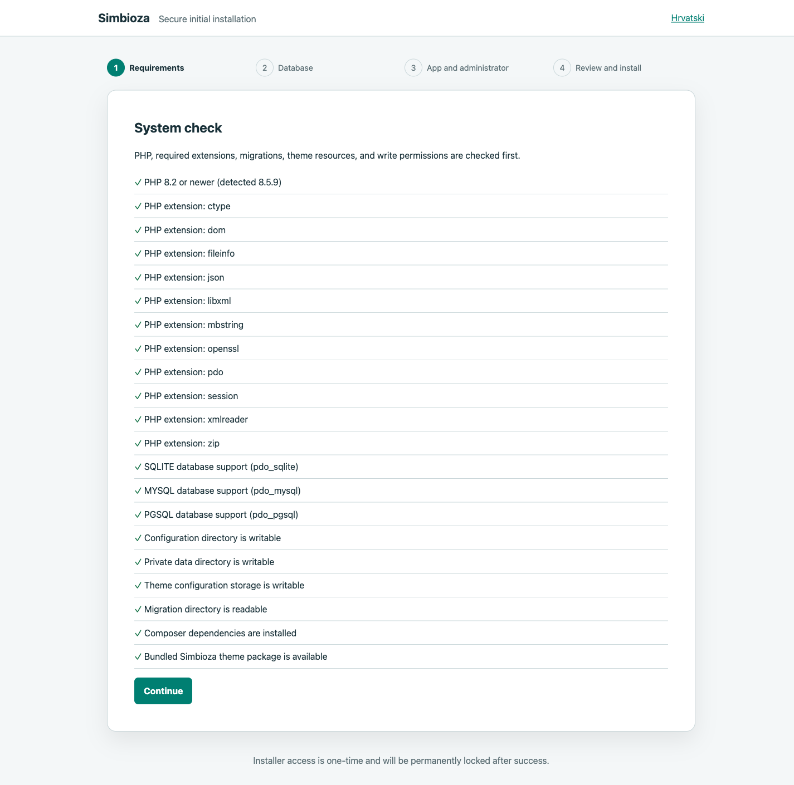
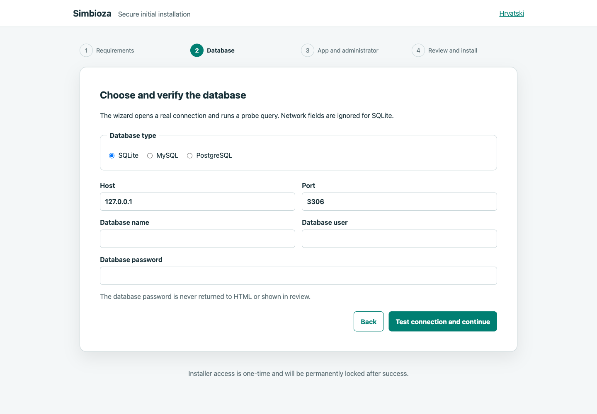
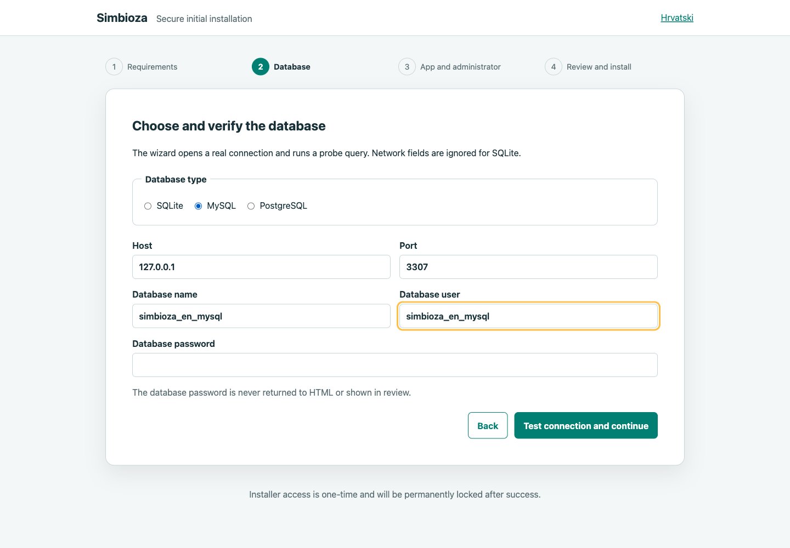
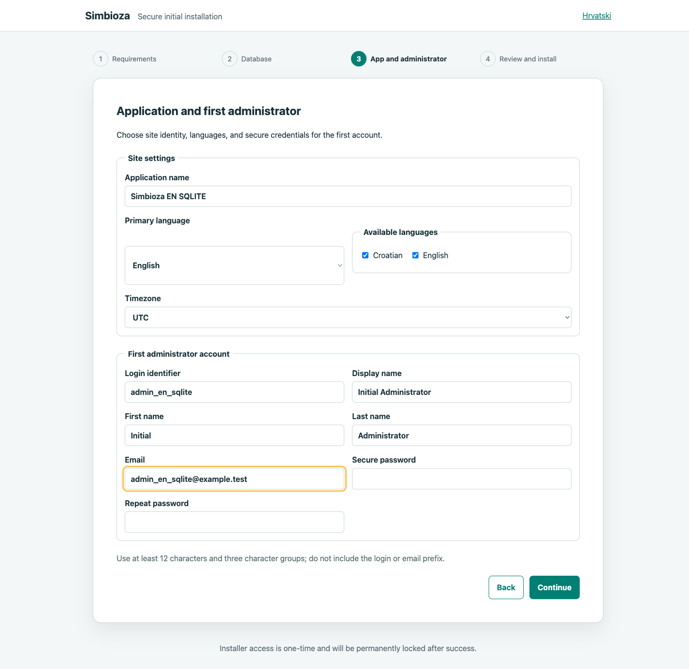
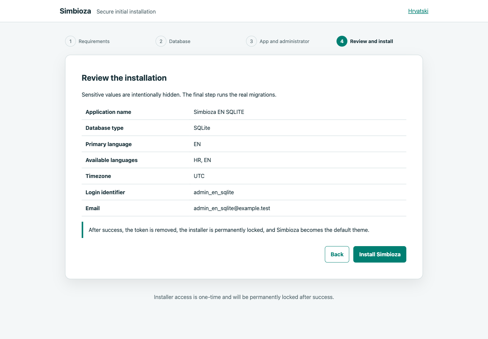
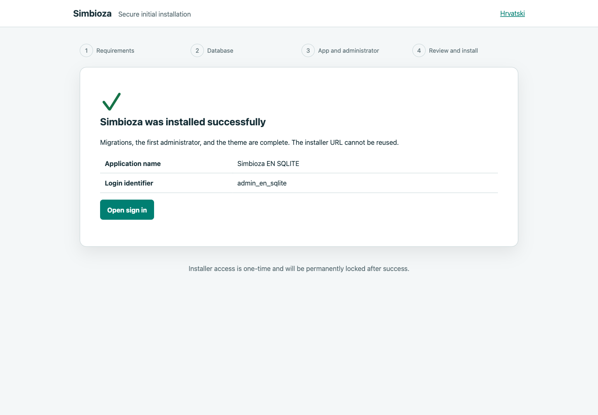

# Installing Simbioza

[Hrvatska verzija](installation_hr.md)

Simbioza provides a one-time web wizard for a completely new installation. The
wizard can only be opened through a secure URL generated by a local CLI command.
After successful migrations, first-administrator creation, and theme and public-guide import, it
writes the permanent `data/installation.lock`, removes the token, and disables
`/install`.

## 1. Requirements

- Linux, macOS, or another supported PHP environment;
- PHP 8.2 or newer;
- Composer 2 and Git access to package repositories;
- Apache 2.4 or Nginx;
- PHP-FPM when the web server does not execute PHP directly;
- an empty SQLite, MySQL, or PostgreSQL database;
- HTTPS for every publicly reachable installation.

Required PHP extensions are:

```text
ctype dom fileinfo json libxml mbstring openssl pdo session xmlreader zip
```

Enable the matching PDO extension as well: `pdo_sqlite`, `pdo_mysql`, or
`pdo_pgsql`. Check the runtime and Composer requirements with:

```bash
php -v
php -m
composer check-platform-reqs --no-dev
```

The [PHP extension index](https://www.php.net/manual/en/extensions.alphabetical.php)
lists the extensions; `mbstring` is not enabled by every PHP build.

## 2. Fetch the application

For a development checkout whose changes are tracked by Git, use:

```bash
git clone https://github.com/kmihalj/Simbioza.git simbioza
cd simbioza
composer update --with-all-dependencies
composer check-platform-reqs --no-dev
```

For a server, prefer a **release installation without a persistent `.git`
directory**. Fetch a tagged release into a temporary directory and copy only
its files into the application directory. Example for release `0.1.9`:

```bash
git clone --quiet --depth 1 --branch 0.1.9 --single-branch \
  https://github.com/kmihalj/Simbioza.git /tmp/simbioza-release
mkdir -p /srv/simbioza
rsync --archive --exclude=.git/ /tmp/simbioza-release/ /srv/simbioza/
cd /srv/simbioza
composer update --with-all-dependencies --no-dev --optimize-autoloader
composer check-platform-reqs --no-dev
```

You may remove the temporary checkout after verification. This is why `.git`
does not exist in the installed application: it is neither lost nor required at
runtime. The installation keeps its own `composer.lock`, through which Composer
records the exact installed module releases. Future upgrades use the standalone
`update.php` described in section 11 without turning the server into a
development Git checkout.

The project uses the tagged Framework `^0.0.24` release and compatible internal
module releases from the `^0.1.0` line. It does not commit `composer.lock`. An
organization may generate and retain its own verified deployment lock, but
should not mix it into the source repository.

## 3. Directories and permissions

Only `public/` may be the document root. Never expose `config/`, `data/`,
migrations, or the theme package directly. PHP needs read access to the project
and narrowly scoped write access:

```bash
mkdir -p data data/logs data/cache data/themes
chmod 750 config data resources/config/theme resources/config/menu
find data -type d -exec chmod 750 {} \;
find data -type f -exec chmod 640 {} \;
```

Set ownership for the PHP-FPM pool or Apache process user. Do not use
`chmod 777`. The installer writes `config/database.php`, `config/env.php`, and
`config/installation.php` with mode `0600`.
The `resources/config/menu` directory must be writable because importing the
starter user-guide workspace also restores its special-menu configuration.

## 4. Apache 2.4

Use `public/` as the root and allow only the project's rewrite directives:

```apache
<VirtualHost *:443>
    ServerName simbioza.example.org
    DocumentRoot /srv/simbioza/public

    <Directory /srv/simbioza/public>
        Options -Indexes +FollowSymLinks
        AllowOverride FileInfo Options
        Require all granted
    </Directory>

    SSLEngine on
    # Add your organization's certificate and private key here.
</VirtualHost>
```

Enable `mod_rewrite`, TLS, and the appropriate PHP/PHP-FPM integration. The
official [Apache mod_rewrite documentation](https://httpd.apache.org/docs/2.4/mod/mod_rewrite.html)
explains the `AllowOverride` requirement. Moving `public/.htaccess` rules into
the VirtualHost and using `AllowOverride None` is even tighter.

## 5. Nginx and PHP-FPM

Example using a private PHP-FPM Unix socket:

```nginx
server {
    listen 443 ssl http2;
    server_name simbioza.example.org;
    root /srv/simbioza/public;
    index index.php;

    location / {
        try_files $uri $uri/ /index.php?$query_string;
    }

    location ~ \.php$ {
        try_files $uri =404;
        include fastcgi_params;
        fastcgi_param SCRIPT_FILENAME $document_root$fastcgi_script_name;
        fastcgi_pass unix:/run/php/php-fpm-simbioza.sock;
    }

    location ~ /\. {
        deny all;
    }
}
```

See Nginx documentation for
[`try_files`](https://nginx.org/en/docs/http/ngx_http_core_module.html) and
[FastCGI parameters](https://nginx.org/en/docs/http/ngx_http_fastcgi_module.html).
The PHP-FPM pool must listen on a private socket or restricted local TCP port;
never expose FPM publicly. The official
[PHP-FPM configuration manual](https://www.php.net/manual/en/install.fpm.configuration.php)
covers `listen`, socket ownership, process management, and logging.

## 6. Prepare an empty database

The installer rejects a database containing user tables. Use a new empty
database and a dedicated application user without global or administrative
privileges for every attempt.

### SQLite

No server preparation is required. The installer creates
`data/simbioza.sqlite`; PHP must be able to write to `data/`. SQLite works well
for development and smaller single-server installations. Benchmark real write
concurrency before a busy production deployment.

### MySQL

Sign in as an authorized database administrator, then create an empty database
and restricted user. Supply the password through your organization's secure
mechanism and keep it out of shell history:

```sql
CREATE DATABASE simbioza CHARACTER SET utf8mb4 COLLATE utf8mb4_unicode_ci;
CREATE USER 'simbioza'@'127.0.0.1' IDENTIFIED BY '<unique-secure-password>';
GRANT ALL PRIVILEGES ON simbioza.* TO 'simbioza'@'127.0.0.1';
```

See the official MySQL references for
[CREATE USER](https://dev.mysql.com/doc/refman/8.4/en/create-user.html) and
[GRANT](https://dev.mysql.com/doc/refman/9.1/en/grant.html). Never connect the
application as MySQL `root`.

### PostgreSQL

Use a role without superuser, `CREATEDB`, `CREATEROLE`, replication, or
bypass-RLS privileges:

```bash
createuser --pwprompt --no-superuser --no-createdb --no-createrole simbioza
createdb --owner=simbioza --encoding=UTF8 simbioza
```

See PostgreSQL documentation for
[`createuser`](https://www.postgresql.org/docs/current/app-createuser.html) and
[`createdb`](https://www.postgresql.org/docs/current/app-createdb.html).

## 7. Start the one-time installer

From the application root, run:

```bash
bin/simbioza install:prepare --base-url=https://simbioza.example.org
```

The `--base-url` value is the public base URL where the application will be
available in a browser. If Simbioza is deployed in a subdirectory, include that
subdirectory in the URL:

```bash
# Application at the domain root
bin/simbioza install:prepare --base-url=https://simbioza.example.org

# Application in the /simbioza subdirectory
bin/simbioza install:prepare --base-url=https://simbioza.example.org/simbioza
```

Do not enter a filesystem path, a trailing `/public`, `/install`, a token, or
query parameters. The CLI appends `/install?token=...` to the base URL itself.

The CLI prints one URL containing a 256-bit token. Copy it directly into a
private browser window. Do not send it through email, chat, tickets, or
screenshots. The first valid request consumes the token, rotates the session ID,
and redirects to clean `/install` without a secret in the address bar. If the
session is lost before completion, rerun the CLI command locally.



## 8. Web-wizard steps

### Step 1 — requirements

The wizard checks PHP, base extensions, all three PDO drivers, Composer
autoloading, migrations, the theme and public-guide packages, and required read/write access. Fix
every red required item before continuing. A database driver becomes mandatory
when its database type is selected.

### Step 2 — database

Choose SQLite, MySQL, or PostgreSQL. For network databases enter the host, port,
empty database name, application user, and password. The password is never
returned in HTML or shown in review. The wizard must open a real PDO connection,
run `SELECT 1`, and verify that no tables exist.





### Step 3 — application and administrator

Enter the application name, primary language, enabled languages, and a PHP
timezone. Then provide the first administrator's login, display name, first and
last name, email, and unique password. The password must contain 12–128
characters and at least three character groups, and must not contain the login
or email prefix. Password fields are never prefilled when returning to the step.



### Step 4 — review and real installation

Review intentionally excludes both passwords. **Install Simbioza** rechecks
requirements and the connection, atomically writes private configuration, runs
every application migration, imports
`resources/installation/theme/simbioza.zip`, verifies its light/dark palettes
and graphics, enables `auto` mode, transactionally creates the first
administrator, and imports the public bilingual **User guides** workspace from
`resources/installation/workspace/korisnicke-upute.zip`. Only then does it write
the lock.



### Step 5 — confirmation and sign-in

The confirmation shows the application name, login identifier, and a link to
`/auth/login`. Reopening the installer URL cannot restart installation.



## 9. Simbioza theme

The theme installation package is already included in the Simbioza repository
at `resources/installation/theme/simbioza.zip`. During installation, the wizard
automatically verifies it, imports it through the Theme service, and makes it
the default theme in `auto` mode; users do not need to export or upload the
theme manually. The package contains `theme.json`, a checksummed
`manifest.json`, light and dark graphics, and the full theme library. After the
first sign-in, open **Settings → Theme** and verify the light, dark, and
automatic display modes.

## 10. First steps after installation

A clean installation intentionally contains only one administrator account,
one active **Simbioza** theme, and one public **User guides** workspace. The
workspace contains seven Croatian-English pages in this order: Simbioza,
Installation, Login and users, Calendars, Workspaces (with the Confluence import
child page), and Editing pages. There are no sample calendars, tasks, extra
themes, or other content.

1. Sign in with the new administrator account.
2. Verify application name, locales, and timezone.
3. Verify the theme and both display variants.
4. Configure SMTP without committing its password.
5. Create initial groups, permissions, and workspaces.
6. Configure secure backup of the database, `config/` secrets, `data/themes`, and uploads.
7. Run required outbox/webhook workers under a process supervisor.
8. Monitor application logs and `data/logs/installer.log` outside web access.

## 11. Updating a release installation

Run the release check and then the update from the application root:

```bash
cd /srv/simbioza
sudo php update.php --check
sudo php update.php
```

Use `sudo` only when the invoking user cannot write to the application
directory. You do not need to know the newest tag: the updater discovers the
latest stable Simbioza release, fetches it into a temporary directory, and asks
Composer to select the newest compatible tags for all modules. To deliberately
use a particular release, pass, for example,
`sudo php update.php --tag=0.1.9`.

Simbioza and every module fetched by the updater are publicly available. The
updater therefore neither requests nor accepts tokens, passwords, or other
credentials for downloading releases.

Before changing files, the updater locks the operation and creates a compressed
code backup in `data/backups/application-updates/`. HTTP requests receive a
bilingual maintenance page with status 503 during the update. It then updates
the code and Composer lock, verifies PHP platform requirements and security
advisories, applies migrations, and clears the cache. It preserves:

- the database, uploads, cache, and other runtime data in `data/`;
- `composer.lock` as the record of this concrete installation;
- private `config/database.php`, `config/env.php`, `config/installation.php`,
  and `config/email.php` files;
- the active menu and theme settings in `resources/config/menu/` and
  `resources/config/theme/`.

If the operation fails before migrations, the updater automatically restores
the previous code and Composer packages. Once migrations have started, it
intentionally leaves maintenance mode enabled because blindly rolling back only
the code is no longer safe. Preserve the output and backup path, correct the
cause, and rerun the updater. A separate, regularly tested backup of the
database and user files remains mandatory.

## 12. Security recommendations

- always use HTTPS and renewable certificates;
- restrict server, database, `config/`, and `data/` access;
- use a dedicated database with least privilege;
- never commit tokens, passwords, runtime configs, or secret-bearing screenshots;
- use correct ownership and modes instead of `777`;
- keep PHP, Composer packages, the web server, and database patched;
- test backup and recovery before production;
- inspect private logs for technical details while users receive only safe errors;
- after a partial failed migration, prepare a new empty database, remove the
  unfinished `data/simbioza.sqlite` for SQLite, and issue a new token.

The installer enforces CSRF validation, one-time authorization, session-ID
rotation, an `HttpOnly`/`SameSite=Strict` cookie, a 30-minute idle timeout,
escaping of all dynamic output, CSP, `X-Frame-Options: DENY`, HSTS, no-sniff,
no-referrer, and no-store caching.

## 13. Optional macOS external-drive example

This is a local example only, not a general requirement. The real installation
stays on the external drive, while Homebrew Apache's web root contains only a
symbolic link to `public/`:

```bash
cd /Volumes/Ext/Development/CR
git clone https://github.com/kmihalj/Simbioza.git simbioza_en_SQLite
ln -s /Volumes/Ext/Development/CR/simbioza_en_SQLite/public \
  /opt/homebrew/var/www/simbioza_en_SQLite
```

Before linking, verify the target does not exist and Apache permits
`SymLinksIfOwnerMatch` or tightly scoped `FollowSymLinks` for this web root.
The [macOS installation lab record](installation-lab_en.md) contains the six
verified installations.

## 14. Diagnostics and verification

```bash
composer on-commit
vendor/bin/phpunit tests/src/Installation/InstallationTest.php
vendor/bin/hph orm-migrate:status
```

After installation, migration status must report zero pending migrations. HTTP
checks should confirm HTTPS, 200 for sign-in and the home page, and 404 for a
second installer request. Never paste secrets into a bug report; send only a
time reference and a private administrator-reviewed log excerpt.
