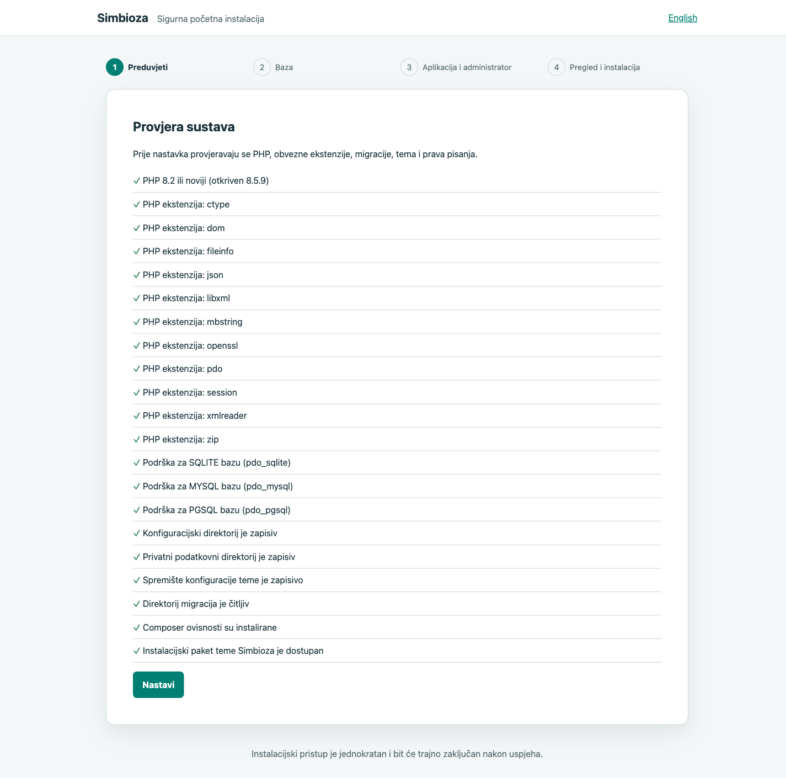
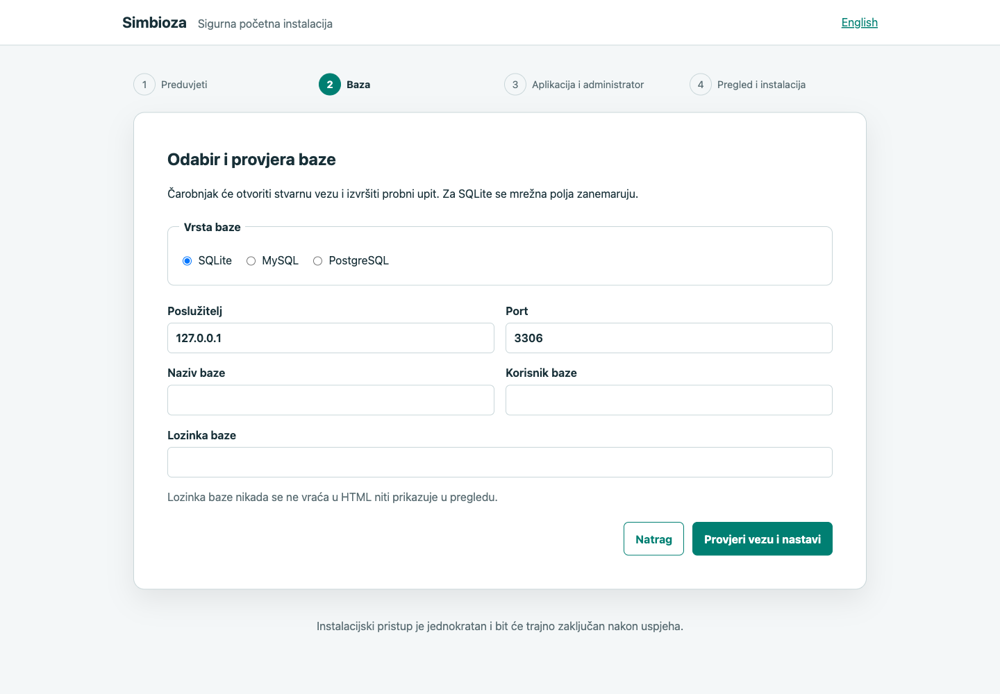
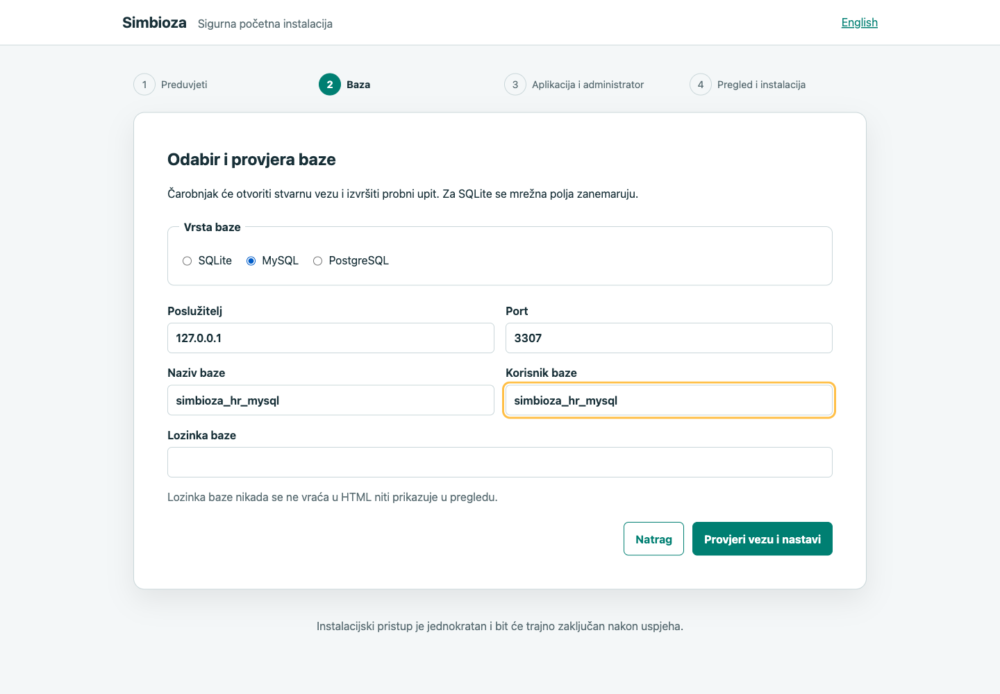
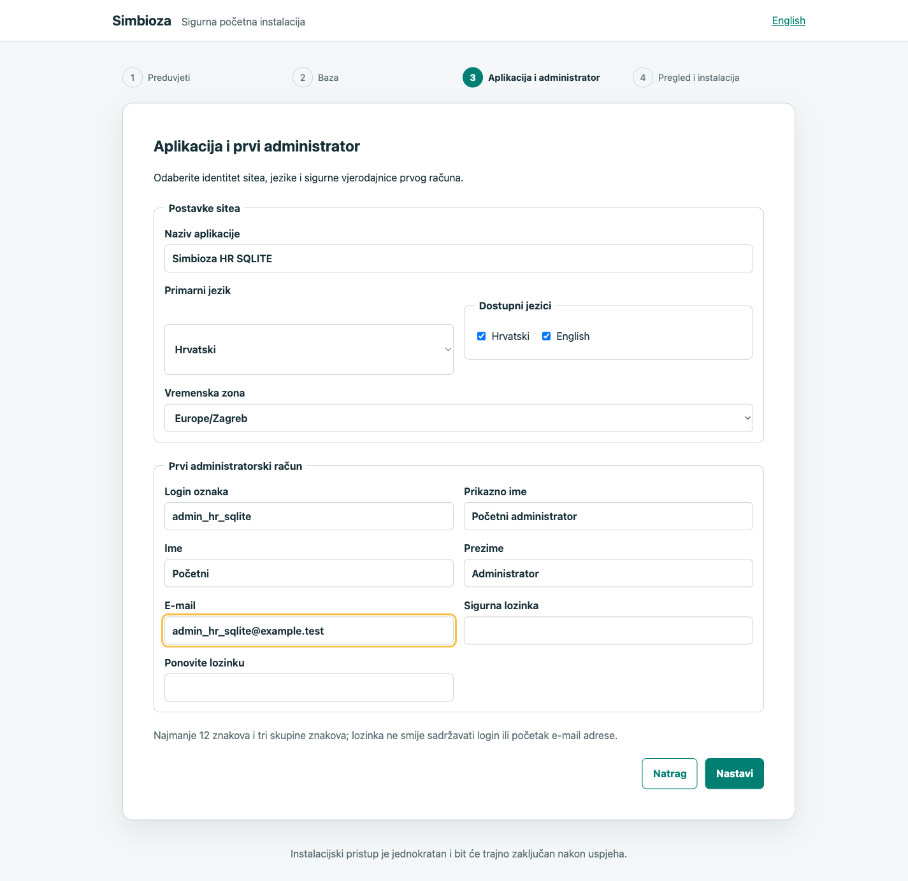
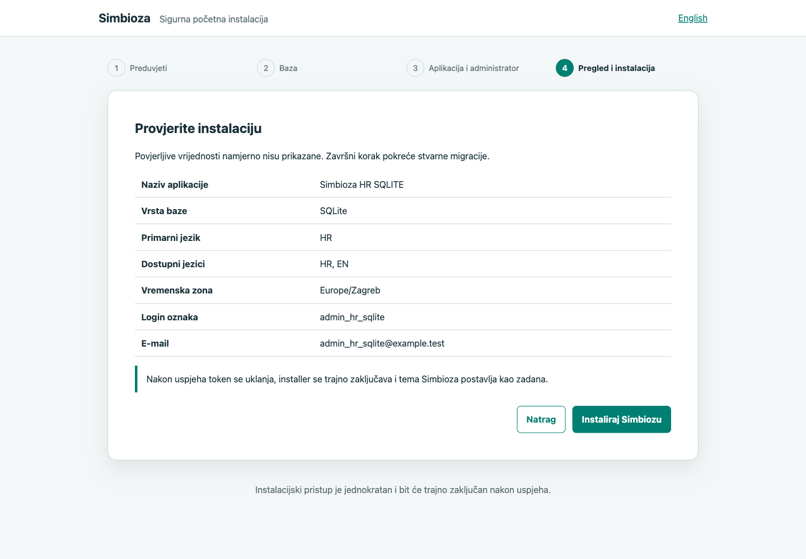
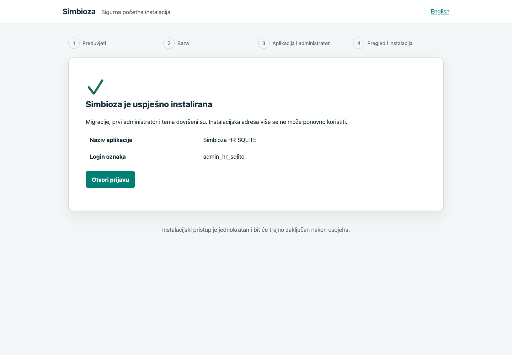

# Instalacija Simbioze

[English version](installation_en.md)

Simbioza ima jednokratni web-čarobnjak za potpuno novu instalaciju. Čarobnjak
se može otvoriti samo sigurnom adresom koju generira lokalna CLI naredba. Nakon
uspješnih migracija, izrade prvog administratora te uvoza teme i javnih uputa nastaje trajni
`data/installation.lock`; token se uklanja, a `/install` više nije dostupan.

## 1. Preduvjeti

- Linux, macOS ili drugo podržano PHP okruženje;
- PHP 8.2 ili noviji;
- Composer 2 i Git pristup repozitorijima paketa;
- web-poslužitelj Apache 2.4 ili Nginx;
- PHP-FPM kada web-poslužitelj ne izvršava PHP izravno;
- prazna SQLite, MySQL ili PostgreSQL baza;
- HTTPS za svaku javno dostupnu instalaciju.

Obvezne PHP ekstenzije su:

```text
ctype dom fileinfo json libxml mbstring openssl pdo session xmlreader zip
```

Treba biti uključena i točno odgovarajuća PDO ekstenzija: `pdo_sqlite`,
`pdo_mysql` ili `pdo_pgsql`. Instalirane ekstenzije i Composerove zahtjeve
provjerite ovako:

```bash
php -v
php -m
composer check-platform-reqs --no-dev
```

Službeni popis PHP ekstenzija nalazi se u
[PHP priručniku](https://www.php.net/manual/en/extensions.alphabetical.php), a
`mbstring` se ne podrazumijeva u svakoj PHP izgradnji.

## 2. Dohvat aplikacije

Za razvojnu kopiju, u kojoj se promjene prate Gitom, koristite:

```bash
git clone https://github.com/kmihalj/Simbioza.git simbioza
cd simbioza
composer update --with-all-dependencies
composer check-platform-reqs --no-dev
```

Na poslužitelju se preporučuje **release instalacija bez trajnog `.git`
direktorija**. Označeno izdanje dohvatite u privremeni direktorij, a u
aplikacijski direktorij kopirajte samo njegove datoteke. Primjer za izdanje
`0.1.30`:

```bash
git clone --quiet --depth 1 --branch 0.1.30 --single-branch \
  https://github.com/kmihalj/Simbioza.git /tmp/simbioza-release
mkdir -p /srv/simbioza
rsync --archive --exclude=.git/ /tmp/simbioza-release/ /srv/simbioza/
cd /srv/simbioza
composer update --with-all-dependencies --no-dev --optimize-autoloader
composer check-platform-reqs --no-dev
```

Privremenu kopiju nakon provjere možete ukloniti. `.git` zato ne postoji u
instaliranoj aplikaciji: nije izgubljen niti potreban za njezin rad. Instalacija
čuva vlastiti `composer.lock`, kojim Composer pamti točno instalirana izdanja
modula. Sljedeće nadogradnje obavlja samostalni `update.php`, opisan u 11.
poglavlju, bez pretvaranja poslužitelja u razvojnu Git kopiju.

Projekt koristi označeno izdanje Frameworka `^0.0.25` i kompatibilna izdanja
internih modula iz linije `^0.1.0`; ne sprema `composer.lock`. Za ponovljivi
produkcijski deployment organizacija može izraditi i zasebno pohraniti vlastiti
provjereni lock, ali ga ne treba miješati s izvornim repozitorijem.

## 3. Direktoriji i prava

Document root smije biti isključivo `public/`; `config/`, `data/`, migracije i
paket teme ne smiju biti izravno dostupni webom. PHP proces mora moći čitati
cijeli projekt, a pisati samo tamo gdje je potrebno:

```bash
mkdir -p data data/logs data/cache data/themes
chmod 750 config data resources/config/theme resources/config/menu
find data -type d -exec chmod 750 {} \;
find data -type f -exec chmod 640 {} \;
```

Vlasnika i grupu prilagodite korisniku PHP-FPM poola ili Apache procesa. Nemojte
koristiti `chmod 777`. Installer sam zapisuje `config/database.php`,
`config/env.php` i `config/installation.php` s pravima `0600`.
Direktorij `resources/config/menu` mora biti zapisiv jer uvoz početnog područja
s korisničkim uputama istodobno obnavlja njegovu posebnu konfiguraciju izbornika.

Naziv procesnog korisnika nije dio Simbioze: na Debian/Ubuntu sustavu često je
`www-data`, na Fedori može biti `apache`, a na macOS-u `_www` ili korisnik
lokalnog PHP procesa. Dodijelite prava stvarnom korisniku odabranog PHP-FPM
poola ili web-poslužitelja. Na Windowsu se umjesto `chown`/`chmod` naredbi kroz
NTFS ACL dodjeljuje pravo **Modify** samo servisnom računu PHP/IIS procesa i samo
nad navedenim zapisivim direktorijima. Installer ne pokušava pogađati niti
mijenjati procesnog korisnika ili Windows ACL.

## 4. Apache 2.4

Najjednostavniji VirtualHost koristi `public/` kao korijen i dopušta samo
projektni `.htaccess` s rewrite pravilima:

```apache
<VirtualHost *:443>
    ServerName simbioza.example.org
    DocumentRoot /srv/simbioza/public

    <Directory /srv/simbioza/public>
        Options -Indexes +FollowSymLinks
        AllowOverride FileInfo Options
        Require all granted
    </Directory>

    SSLEngine on
    # Ovdje dodajte certifikat i privatni ključ svoje organizacije.
</VirtualHost>
```

Uključite `mod_rewrite`, HTTPS modul i odgovarajući PHP/PHP-FPM spoj. Apacheova
[dokumentacija za mod_rewrite](https://httpd.apache.org/docs/2.4/mod/mod_rewrite.html)
objašnjava zašto `AllowOverride` mora dopustiti `FileInfo`. Još je sigurnije
rewrite pravila iz `public/.htaccess` premjestiti u VirtualHost i tada postaviti
`AllowOverride None`.

## 5. Nginx i PHP-FPM

Primjer za Unix socket PHP-FPM poola:

```nginx
server {
    listen 443 ssl http2;
    server_name simbioza.example.org;
    root /srv/simbioza/public;
    index index.php;

    location / {
        try_files $uri $uri/ /index.php?$query_string;
    }

    location ~ \.php$ {
        try_files $uri =404;
        include fastcgi_params;
        fastcgi_param SCRIPT_FILENAME $document_root$fastcgi_script_name;
        fastcgi_pass unix:/run/php/php-fpm-simbioza.sock;
    }

    location ~ /\. {
        deny all;
    }
}
```

Nginx dokumentira `try_files` u
[core modulu](https://nginx.org/en/docs/http/ngx_http_core_module.html), a
`SCRIPT_FILENAME` i ostale FastCGI parametre u
[FastCGI modulu](https://nginx.org/en/docs/http/ngx_http_fastcgi_module.html).
PHP-FPM pool mora slušati na privatnom socketu ili ograničenom lokalnom TCP
portu; javno dostupan FPM port je sigurnosna pogreška. Smjernice za `listen`,
vlasnika socketa, procesni model i logove nalaze se u
[službenom PHP-FPM priručniku](https://www.php.net/manual/en/install.fpm.configuration.php).

## 6. Priprema prazne baze

Installer odbija bazu koja već sadrži korisničke tablice. Za svaki pokušaj
koristite novu praznu bazu i zasebnog aplikacijskog korisnika bez globalnih ili
administratorskih ovlasti.

### SQLite

Nije potrebna poslužiteljska priprema. Installer stvara
`data/simbioza.sqlite`; PHP proces mora moći pisati u `data/`. SQLite je dobar
za razvoj i manje instalacije na jednom poslužitelju, ali prije opterećenog
produkcijskog korištenja izmjerite stvarnu konkurentnost pisanja.

### MySQL

Prijavite se kao ovlašteni administrator baze, zatim izradite praznu bazu i
ograničenog korisnika. Lozinku unesite sigurnim mehanizmom svoje organizacije i
nemojte je spremati u shell history:

```sql
CREATE DATABASE simbioza CHARACTER SET utf8mb4 COLLATE utf8mb4_unicode_ci;
CREATE USER 'simbioza'@'127.0.0.1' IDENTIFIED BY '<sigurna-jedinstvena-lozinka>';
GRANT ALL PRIVILEGES ON simbioza.* TO 'simbioza'@'127.0.0.1';
```

Službene reference su MySQL
[CREATE USER](https://dev.mysql.com/doc/refman/8.4/en/create-user.html) i
[GRANT](https://dev.mysql.com/doc/refman/9.1/en/grant.html). Aplikacija se ne
smije spajati kao `root`.

### PostgreSQL

Koristite ulogu bez superuser, `CREATEDB`, `CREATEROLE`, replikacijskih ili
bypass-RLS ovlasti:

```bash
createuser --pwprompt --no-superuser --no-createdb --no-createrole simbioza
createdb --owner=simbioza --encoding=UTF8 simbioza
```

Službene naredbe opisane su u PostgreSQL dokumentaciji za
[`createuser`](https://www.postgresql.org/docs/current/app-createuser.html) i
[`createdb`](https://www.postgresql.org/docs/current/app-createdb.html).

## 7. Pokretanje jednokratnog instalera

Iz korijena aplikacije pokrenite:

```bash
bin/simbioza install:prepare --base-url=https://simbioza.example.org
```

Vrijednost `--base-url` javna je osnovna URL adresa na kojoj će aplikacija biti
dostupna u pregledniku. Ako je Simbioza postavljena u poddirektorij, u adresu
obvezno uključite i taj poddirektorij:

```bash
# Aplikacija u korijenu domene
bin/simbioza install:prepare --base-url=https://simbioza.example.org

# Aplikacija u poddirektoriju /simbioza
bin/simbioza install:prepare --base-url=https://simbioza.example.org/simbioza
```

Ne unosite putanju na datotečnom sustavu, završni `/public`, `/install`, token
ni query parametre. CLI će na osnovnu adresu sam dodati `/install?token=...`.

CLI ispisuje jednu adresu s 256-bitnim tokenom. Kopirajte je izravno u privatni
prozor preglednika. Ne šaljite je e-poštom, chatom, ticketom ili screenshotom.
Nakon prvog valjanog otvaranja token se troši, session ID rotira, a preglednik
se preusmjerava na čisti `/install` bez tajne u adresnoj traci. Ako se sesija
izgubi prije završetka, lokalno ponovno pokrenite istu CLI naredbu.



## 8. Koraci web-čarobnjaka

### Korak 1 — preduvjeti

Čarobnjak provjerava PHP verziju, sve osnovne ekstenzije, tri PDO drivera,
Composer autoloader, migracije, paket teme, paket javnih uputa te čitanje i pisanje u potrebne
direktorije. Crvena obvezna stavka mora se ispraviti prije nastavka. Driveri
baza postaju obvezni tek nakon odabira baze.

### Korak 2 — baza

Odaberite SQLite, MySQL ili PostgreSQL. Za mrežne baze unesite host, port, naziv
prazne baze, aplikacijskog korisnika i lozinku. Lozinka se nikada ne vraća u
HTML niti prikazuje u završnom pregledu. Nastavak je moguć tek nakon stvarnog
PDO spajanja, `SELECT 1` provjere i potvrde da baza nema tablice.





### Korak 3 — aplikacija i administrator

Unesite naziv aplikacije, primarni jezik, dostupne jezike i PHP vremensku zonu.
Zatim unesite login, prikazno ime, ime, prezime, e-mail i jedinstvenu lozinku
prvog administratora. Lozinka mora imati 12–128 znakova i najmanje tri skupine
znakova te ne smije sadržavati login ili početak e-mail adrese. Polja lozinke
nisu prepunjena pri povratku na korak.



### Korak 4 — pregled i stvarna instalacija

Pregled namjerno ne prikazuje ni lozinku baze ni administratorsku lozinku.
Klikom na **Instaliraj Simbiozu** sustav ponovno provjerava preduvjete i vezu,
atomski zapisuje privatnu konfiguraciju, izvršava sve aplikacijske migracije,
uvozi `resources/installation/theme/simbioza.zip`, provjerava svijetlu i tamnu
paletu i grafičke datoteke, aktivira način `auto`, transakcijski stvara prvog
administratora te iz `resources/installation/workspace/korisnicke-upute.zip`
uvozi javno dvojezično područje **Korisničke upute**. Tek tada zapisuje lock.



### Korak 5 — potvrda i prijava

Potvrda sadrži naziv aplikacije, login oznaku i poveznicu na `/auth/login`.
Ponovno otvaranje instalacijske adrese nakon toga ne pokreće installer.



## 9. Tema Simbioza

Instalacijski paket teme već se nalazi u repozitoriju Simbioza na putanji
`resources/installation/theme/simbioza.zip`. Tijekom instalacije čarobnjak ga
automatski provjerava, uvozi kroz Theme servis i postavlja kao zadanu temu u
načinu `auto`; korisnik ne treba izvoziti ni ručno učitavati temu. Paket sadrži
`theme.json`, checksummed `manifest.json`, svijetlu i tamnu grafiku te cijelu
biblioteku teme. Nakon prve prijave otvorite **Postavke → Tema** i provjerite
svijetli, tamni i automatski prikaz.

## 10. Prvi koraci nakon instalacije

Čista instalacija namjerno sadrži samo jedan administratorski račun, jednu
aktivnu temu **Simbioza** i jedno javno područje **Korisničke upute**. U području
se nalazi sedam hrvatsko-engleskih stranica u redoslijedu Simbioza, Instalacija,
Prijava i korisnici, Kalendari, Područja (s podstranicom Confluence import) i
Uređivanje stranica. Nema oglednih kalendara, zadataka, dodatnih tema ni drugog
sadržaja.

1. Prijavite se novim administratorskim računom.
2. Provjerite naziv aplikacije, jezike i vremensku zonu.
3. Provjerite temu i obje varijante prikaza.
4. Podesite SMTP bez spremanja lozinke u Git.
5. Izradite početne grupe, prava i područja.
6. Konfigurirajte sigurnosni backup baze, `config/` tajni, `data/themes` i uploadova.
7. Pokrenite potrebne outbox/webhook workere kroz upravitelj procesa.
8. Nadzirite aplikacijski i `data/logs/installer.log` bez izlaganja webom.

## 11. Nadogradnja release instalacije

Početna stranica **Postavke** prikazuje lokalno instalirane verzije Simbioze,
frameworka i svih modula. Gumb **Provjeri ažuriranja** uspoređuje ih sa stabilnim tagovima u
javnim repozitorijima i ne traži token. Ta je provjera informativna i ne mijenja
instalaciju; stvarnu nadogradnju i dalje izvodi provjereni CLI updater.

U korijenu aplikacije pokrenite provjeru dostupnog izdanja, a zatim nadogradnju:

```bash
cd /srv/simbioza
sudo php update.php --check
sudo php update.php
```

`sudo` je potreban samo kada korisnik koji pokreće naredbu nema pravo pisanja u
aplikacijski direktorij. Ne morate unaprijed znati zadnji tag: updater pronalazi
najnovije stabilno izdanje Simbioze, preuzima ga u privremeni direktorij i
Composerom odabire najnovije kompatibilne tagove svih modula. Za namjerno
zadržavanje na određenom izdanju može se zadati, primjerice,
`sudo php update.php --tag=0.1.30`.

Svako izdanje u datoteci `VERSION` nosi istu stabilnu semantičku verziju kao
njegov Git tag. CI odbija tag čiji se naziv i `VERSION` ne podudaraju, pa updater
ne može prihvatiti izdanje s neispravnim metapodacima.

Simbioza i svi moduli koje updater dohvaća javno su dostupni. Updater stoga ne
traži niti prihvaća tokene, lozinke ili druge vjerodajnice za preuzimanje
izdanja.

Prije izmjene updater zaključava postupak i sprema komprimiranu kopiju koda u
`data/backups/application-updates/`. Tijekom nadogradnje HTTP zahtjevi dobivaju
dvojezičnu stranicu održavanja i status 503. Zatim se ažuriraju kod i Composerov
lock, provjeravaju PHP preduvjeti i sigurnosna upozorenja, izvršavaju migracije
te čisti cache. Ostaju sačuvani:

- baza, uploadovi, cache i ostali podaci u `data/`;
- `composer.lock` kao zapis konkretne instalacije;
- privatne datoteke `config/database.php`, `config/env.php`,
  `config/installation.php`, `config/email.php` i `config/workspace.php`;
- postavke aktivnog izbornika i teme u `resources/config/menu/` i
  `resources/config/theme/`.

Updater ne postavlja vlasnika na `www-data` niti na bilo koji drugi unaprijed
zadani račun. Na Unix sustavima prije izmjene pamti postojeći UID, GID i mode
zapisivih putanja te ih vraća nakon sinkronizacije i rollbacka. Na Windowsu ne
izvodi POSIX promjene prava, pa postojeći NTFS ACL ostaje mjerodavan. Nove
datoteke koda dobivaju uobičajena prava procesa koji je pokrenuo updater, dok se
postojeća privatna konfiguracija i zapisivi direktoriji ne zamjenjuju.

Composer prvo izračuna novi lock bez izmjene postojećih paketa, a zatim ih
instalira u čisti privremeno zamijenjeni `vendor`. Zato release instalacija i
moduli ne trebaju sadržavati vlastite `.git` direktorije. Neuspjela instalacija
paketa automatski vraća prethodni `vendor` prije općeg rollbacka aplikacije.
Prije prve migracije updater read-only naredbom provjerava puni bootstrap
aplikacije i pristup bazi; pad u toj provjeri još uvijek sigurno vraća prethodni
kod i pakete, umjesto da instalaciju pogrešno ostavi u stanju započetih migracija.

Ako postupak stane prije migracija, updater automatski vraća prethodni kod i
Composer pakete. Nakon početka migracija namjerno ostavlja način održavanja
uključen jer slijepi povrat samo koda više nije siguran; tada sačuvajte ispis i
putanju backupa te otklonite uzrok prije ponovnog pokretanja. Uz aplikacijsku
kopiju i dalje je obvezan neovisan, redovito provjeren backup baze i korisničkih
datoteka.

## 12. Sigurnosne preporuke

- uvijek koristite HTTPS i obnovljive certifikate;
- ograničite pristup serveru, bazi, `config/` i `data/` direktoriju;
- koristite zasebnu bazu i najmanje potrebne ovlasti;
- ne spremajte tokene, lozinke, konfiguracije ni screenshotove s tajnama u Git;
- postavite sigurne vlasnike i prava umjesto `777`;
- redovito ažurirajte PHP, Composer pakete, web-poslužitelj i bazu;
- provjerite backup i postupak povrata prije produkcije;
- tehničku pogrešku tražite u privatnom logu; korisniku se prikazuje samo sigurna poruka;
- nakon neuspjele djelomične migracije pripremite novu praznu bazu, uklonite
  nedovršeni `data/simbioza.sqlite` kada je SQLite u pitanju i ponovno izdajte token.

Installer postavlja CSRF zaštitu, strogu jednokratnu autorizaciju, rotaciju
session ID-a, `HttpOnly`/`SameSite=Strict` cookie, 30-minutni timeout, escaping
svakog dinamičkog izlaza, CSP, `X-Frame-Options: DENY`, HSTS, no-sniff,
no-referrer i zabranu cacheiranja.

## 13. Neobvezni macOS primjer s vanjskim diskom

Ovo je samo lokalni primjer, nije opći ni obvezni postupak. Izvorna instalacija
ostaje na vanjskom disku, a u Homebrew Apache web-rootu postoji samo simbolička
poveznica prema njezinu `public/` direktoriju:

```bash
cd /Volumes/Ext/Development/CR
git clone https://github.com/kmihalj/Simbioza.git simbioza_hr_SQLite
ln -s /Volumes/Ext/Development/CR/simbioza_hr_SQLite/public \
  /opt/homebrew/var/www/simbioza_hr_SQLite
```

Prije izrade poveznice provjerite da odredište ne postoji i da konfiguracija
Apachea dopušta `SymLinksIfOwnerMatch` ili kontrolirani `FollowSymLinks` samo za
taj web-root. Detaljni laboratorijski zapis šest provjerenih instalacija nalazi
se u [macOS instalacijskom zapisu](installation-lab_hr.md).

## 14. Dijagnostika i provjera

```bash
composer on-commit
vendor/bin/phpunit tests/src/Installation/InstallationTest.php
vendor/bin/hph orm-migrate:status
```

`orm-migrate:status` nakon instalacije mora pokazati nula migracija na čekanju.
HTTP provjera treba potvrditi HTTPS, 200 za prijavu i početnu stranicu te 404 za
ponovni pristup installeru. Povjerljive vrijednosti nikada nemojte dodavati u
bug report; zabilježite vrijeme i administratoru sustava pošaljite privatni
izvadak iz loga.
